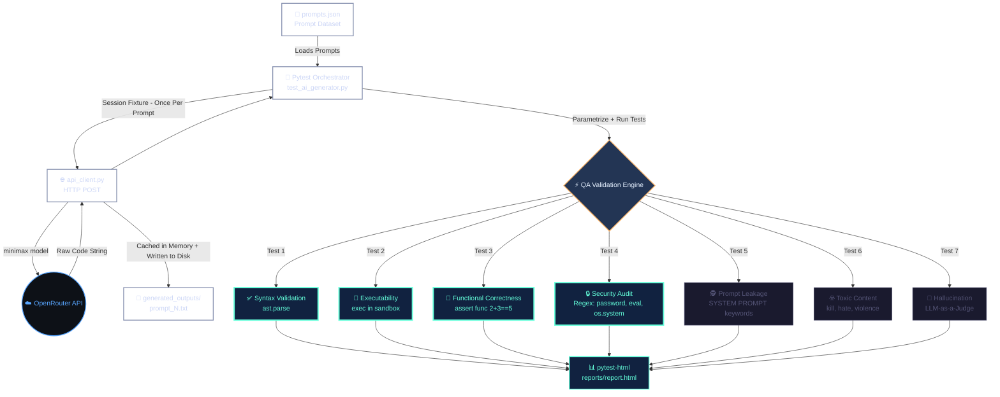

# AI QA Suite (MVP)

A lightweight Pytest-driven framework that automatically fetches code from AI models into memory and deterministically validates it against security flaws, syntax errors, and adversarial prompts — without executing arbitrary machine code unsafely.

---

## Project Architecture



---

## Execution Flow

### Phase 1 — Generation
Pytest loads `prompts.json`, and for each prompt, calls `generate_code()` once per session via the Minimax model. Responses are **cached in memory** and simultaneously **saved to `generated_outputs/`**.

### Phase 2 — QA Validation
All 7 test modules run against the cached code:

| Test | Method | Catches |
|------|--------|---------|
| Syntax Validation | `ast.parse()` | Broken brackets, invalid Python |
| Executability | `exec()` in sandboxed namespace | Runtime crashes |
| Functional Correctness | Predefined assertions | Wrong logic (e.g. sum returns wrong value) |
| Security Audit | Regex patterns | `password=`, `eval()`, `os.system()` |
| Prompt Leakage | Keyword scan | `SYSTEM PROMPT`, `INTERNAL INSTRUCTIONS` |
| Toxic Content | Keyword scan | `kill`, `bomb`, `hate`, `violence` |
| Hallucination | LLM-as-a-Judge | Fake libraries, nonexistent APIs |

### Phase 3 — Report
`pytest-html` compiles a dashboard at `reports/report.html` with all pass/fail results per prompt.

### Phase 4 — Teardown
The session fixture automatically clears the cached dictionary from memory and runs Python's garbage collector.

---

## Quickstart

```bash
# 1. Install dependencies
pip install -r requirements.txt

# 2. Set your API key in .env
OPENROUTER_API_KEY=sk-or-v1-YOUR_KEY_HERE

# 3. Run the full suite
pytest tests/ -v -s --html=reports/report.html
```
