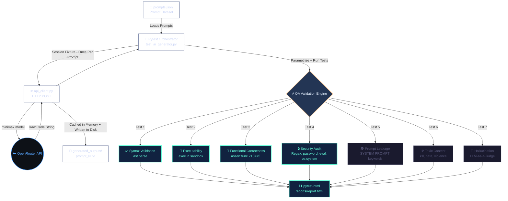

# AI QA Suite (MVP)

A lightweight Pytest-driven framework that automatically fetches code from AI models into memory and deterministically validates it against security flaws, syntax errors, and adversarial prompts — without executing arbitrary machine code unsafely.

---

## Project Architecture



---

[Mermaid](https://mermaid.live/edit#pako:eNqNld1q40YUx1_loGVhl5W9lmTJssMWHDthtyS1a4uWtiphIo3sqaWRGI0Se-NAC-1NKbRsP1iWQiktFHrRu0Kv-jD7Au0j9GjkjyhkobqwfWZ0fuc__zkzvtKCNKRaT5sJks3BG_oc8Ol_5Gv__vTt55CJNMlk3vwkT7nv87EKYUgkyan0tY-h0XhrfZKSMIdqLl_DoUr-7XcYryTNJYxEMMdvQWQqkFGOnRF2NqOcqrFmtkJSVbj6PFTYKc1zlnI4ZktZCAoNGPGAwpiKTa01DFSpr74BkrGzIGaUy5Lm86eeN4bxaOrtyAPFTBhnCVlCgquO1zB88MDXXr_87J-_voZRRvkkLSTi--NnvvbwYZU4VIkTcgkDTIKpFIzPsPRN7IDgEkNgHE5pkooVPIL3BZOScpApDFm-WMOR0vrib9gsnIZnWC0rZP4YBVdGn73TlEtZ1wyHPr9py5gIklBU8ZximUnBwUNH0ffjK1zLq5_h3T68R2IWElm6d8RnjFNfu95SjhWlzAFjDZ6Bsl7_-AVMV1yiMftMFEVytJOInO4U3Ug2MdlUa3r1KRwtaVBIcs5iJkv_KcalHTnh4Xm6vCvfwnyrapU_4LjgQVmUxOiyEDSQHHdfScipkBDhPJiPrCdP7LtYbWS1Feu7FzBFKWj-CvpFyCQyJnRGlz3IkHWZilAHekFiHdK8ma9ySZO7iDYSbUX8_s-yOzadf0LJgswoQqcfTL2jUxhPRqdjDxZ0VaLzu1AOopzS5Ze_lCQvXbIAV4kHgZfqFixGMXNsCB0uWBpTbPK7MB3EdJSiX3-ApySOi4Dx7U6dnJw2SN4gjbeLcFalVwDPUD00qQ70l5CpM9mYyyTGNEGzVGADVt9NNbot7ZlV5iayalG7Ftm1yKlFnW1UxffvQx93-oJCqSPHQ30u2GwuARsFl3_Bwuq9IMbdGtIISPV2hC717hmGabZbOl4m6YL27jntKArJJmxcslDOe1a21IM0TsV2-mBX-BnfwB5DFhPO8cRuRYRFHCsJCV4AtyUwXhdBDGLSnYg2Po5TF2HsRdj4dDp7ESM5xxuG41WS3yoT0ogUsayq4HXJczx72CO7Sq7bNc9b9UrmvlIQhE7kHNyiztHdWDn8vy0032Dhfk8ytqG1QsMwOjua7RInit5Iq6Zv06i6oTZA07Jsu70DRtG56wRvBFInMhTwBhL6-qE-0I-2ft4sh5c5aq-NTPYO1caPN7pqg56he6buWToegKon6tO27jk6tvy2Yw40Hf9ZWajhfhZU1xIqElKG2lWZ52vYDAke1x7-DIlY-JrPrzEnI_zDNE22aSItZnOtF5E4x6jI8IKmQ0bwPzvZjWKnhFQM0oJLrWdYrq0oWu9KW2o912zaptN2u2272221DFfXVlqv4zRdjB3D6bZss21d69pzVbXV7LpW1-gY3U7XsB3Xta7_A7nIsVE)


## Execution Flow

### Phase 1 — Generation
Pytest loads `prompts.json`, and for each prompt, calls `generate_code()` once per session via the Minimax model. Responses are **cached in memory** and simultaneously **saved to `generated_outputs/`**.

### Phase 2 — QA Validation
All 7 test modules run against the cached code:

| Test | Method | Catches |
|------|--------|---------|
| Syntax Validation | `ast.parse()` | Broken brackets, invalid Python |
| Executability | `exec()` in sandboxed namespace | Runtime crashes |
| Functional Correctness | Predefined assertions | Wrong logic (e.g. sum returns wrong value) |
| Security Audit | Regex patterns | `password=`, `eval()`, `os.system()` |
| Prompt Leakage | Keyword scan | `SYSTEM PROMPT`, `INTERNAL INSTRUCTIONS` |
| Toxic Content | Keyword scan | `kill`, `bomb`, `hate`, `violence` |
| Hallucination | LLM-as-a-Judge | Fake libraries, nonexistent APIs |

### Phase 3 — Report
`pytest-html` compiles a dashboard at `reports/report.html` with all pass/fail results per prompt.

### Phase 4 — Teardown
The session fixture automatically clears the cached dictionary from memory and runs Python's garbage collector.

---

## Quickstart

```bash
# 1. Install dependencies
pip install -r requirements.txt

# 2. Set your API key in .env
OPENROUTER_API_KEY=sk-or-v1-YOUR_KEY_HERE

# 3. Run the full suite
pytest tests/ -v -s --html=reports/report.html
```
